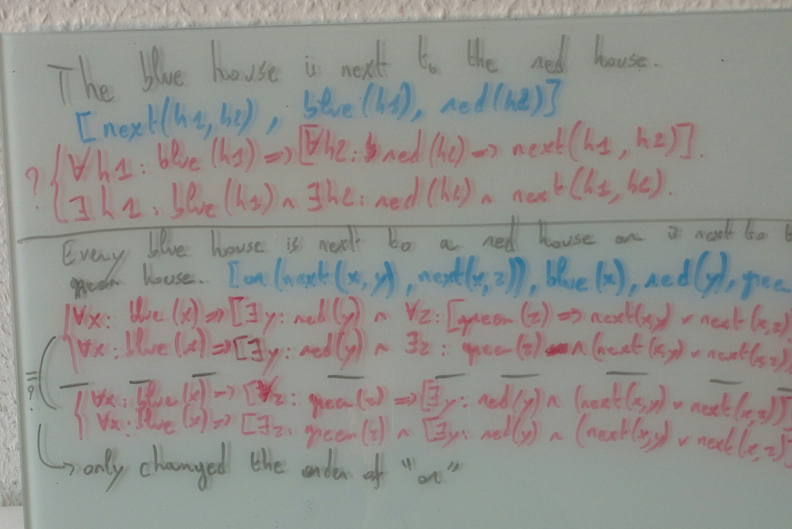

# Meeting thesis 24 november 2016

- the norwegian lives in a house that is next to the blue house
    - Correct:
        - `!x1: lives(norwergian, x1) => ?x2: is_next_to(x1, x2) & color(x2, blue).`
        - `!x1: !x2: lives(norwegian, x1) & color(x2, blue) => is_next_to(x1, x2).`
        - There is a blue house next to the house in which the norwegian lives.
    - Now
        - `∃ x1: ∀ x2: color(x2, blue) ∧ [is,next,to](x1, x2) => lives(norwegian, x1)`.
        - norwegian lives in a house or all houses next to a house are not blue

- there is a person who lives in the green house and drinks coffee
    - `∃ x1: ∀ x2: color(x2, green) => lives(x1, x2) ∧ drinks(x1, coffee).`
    - "Als hem niet in het huis woont, mag het huis niet groen zijn"

- binaire quantificatie: welke 2 leden vooral belangrijk
- ? ! vooral probleem
- "that is" subsentence eens bekijken of die nog problemen geeft.

- Andere zinnen bedenken met gemixte quantoren:
    - every depertament with a large budget, has at least 1 paid employee
- Best eerste quantoren, dan andere puzzle
- ! ? of ? ! niet in zelfde scope => Warning als het dat wel doet?

# Week van 24 november t.e.m. 1 december 2016

- 
    1. Get order of quantifiers from sentence
    - Find all variables used for every term in the list
    - Output all predicates without variables
    - Output "&"
    - Pop first quantifier from list and output it
    - Pop predicates from list that only use the variable just quantified. Combining them with "&".
    - Output the right combination (=> for forall, & for exists).
    - Pop predicates from list that only use variables quantified over already and output them. Combining them with "&".
    - Go to 5 unless list is empty.
- [ ] The: both existential and universal quantification?
    - The blue house is next to the red house
        - `! h1: blue(h1) => (!h2: red(h2) => next(h1, h2))`
        - `? h1: blue(h1) & (?h2: red(h2) & next(h1, h2))`
    - so not assuming there is exactly one but do assume there is at least one!
    - See difference with:
    - Every blue house is next to the red house.
    - The above doesn't assume there is a blue house. The first sentence does
    - 
        - Sentence2: Without the combination of both quantifiers, the order of "or" matters.
            - In order 2: a world with only blue houses is a model.
            - In order 1: a blue house implies the existence of a red house so only blue houses is not a model.
- [ ] Double parses
    - The norwegian lives in a house that is next to the blue house or is next to the green house.
    - oplossen op basis van type en anders warning/error?
- And/or reordening
    - 
